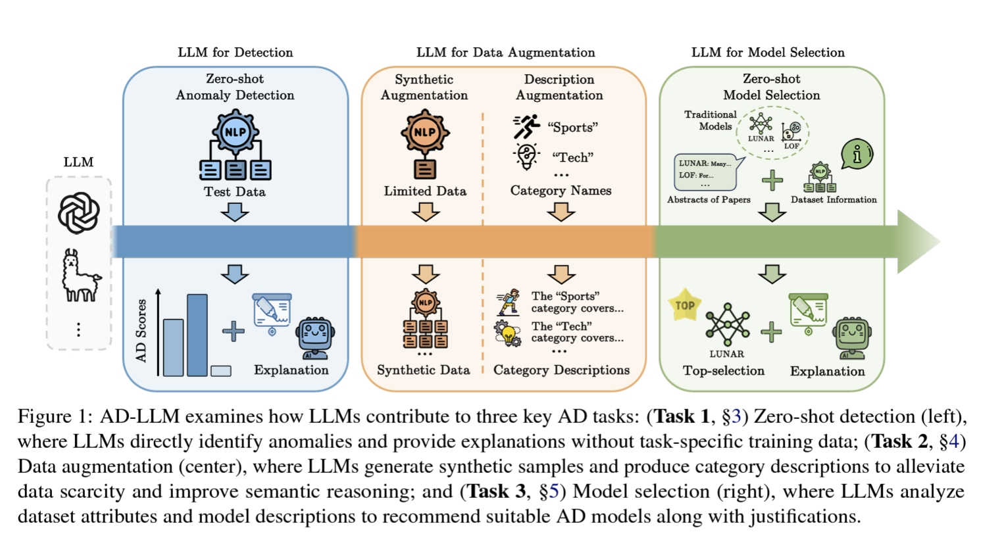

# AD-LLM: Benchmarking Large Language Models for Anomaly Detection

## Overview

**AD-LLM** introduces the first benchmark that evaluates how large language models (LLMs) can assist with natural language processing (NLP) tasks in anomaly detection (AD). We consider three key tasks:

1. **Zero-shot Detection**  
   Using LLMs' pre-trained knowledge to detect anomalies without task-specific training.

2. **Data Augmentation**  
   a. **Synthetic Data Generation**: Generating synthetic data to improve AD models.  
   b. **Category Descriptions Generation**: Creating category descriptions to enhance LLM-based AD.

3. **Model Selection**  
   Suggesting suitable unsupervised AD models through LLM-guided recommendations.

Our benchmark evaluates LLMs such as GPT-4 and Llama 3.1 across multiple datasets, providing a clear assessment of their capabilities in AD scenarios.




## Citation

If you find this work useful, please cite our paper:

[**Paper Link**](https://arxiv.org/abs/2412.11142): https://arxiv.org/abs/2412.11142

```bibtex
@article{yang2024ad,
  title={AD-LLM: Benchmarking Large Language Models for Anomaly Detection},
  author={Yang, Tiankai and Nian, Yi and Li, Shawn and Xu, Ruiyao and Li, Yuangang and Lin, Jiaqi and Xiao, Zhuo and Hu, Xiyang and Rossi, Ryan and Ding, Kaize and Hu, Xia and Zhao, Yue},
  journal={arXiv preprint arXiv:2412.11142},
  year={2024}
}
```

## Environment Set-up
We use anaconda to create python environment and install required libraries:

```bash
# create the environment and activate it
conda create --name ad_llm python=3.11
conda activate ad_llm

# install basic packages
conda install numpy scipy scikit-learn matplotlib tqdm

# install PyTorch (adjust the CUDA version accordingly)
conda install pytorch torchvision pytorch-cuda=12.4 -c pytorch -c nvidia

# install PyOD
conda install -c conda-forge pyod

# install libraries for Llama
conda install -c conda-forge transformers
pip install --upgrade huggingface hub
pip install accelerate

# install libraries for GPT
pip install openai
```

## Usage
### 1. Zero-shot Detection
* Set `_ad_setting=1` in `config.py` to run "Normal Only" setting; set `_ad_setting=2` in `config.py` to run "Normal + Anomaly" setting.
* To run experiments with Llama 3.1: `python ad_llama.py`.
* To run experiments with GPT-4o: `python ad_gpt.py`.
### 2. Data Augmentation
#### 1. Synthetic Data Generation
* Change `_num_keyword_groups_act` in `config.py` to adjust the size of synthetic samples per category.
* To generate synthetic data: `python aug_synth_gpt.py`.
* To run experiments with synthetic data: `python baseline_w_gpt_embed.py`
#### 2. Category Descriptions Generation
* For Llama:
    * To generate category description: `python aug_desc_llama.py`.
    * To run experiments with category description, set `_use_desc = True`, then run `python ad_llama.py`.
* For GPT:
    * To generate category description: `python aug_desc_gpt.py`.
    * To run experiments with category description, set `_use_desc = True`, then run `python ad_gpt.py`.
* Remember to set `_use_desc = False` back when you do not wish to use category description.
### 3. Model Selection
* To run experiments: `python select_gpt.py`.

## Notes
* We provide one example dataset "BBC News". Please check [NLP-ADBench](https://github.com/USC-FORTIS/NLP-ADBench) for more datasets (AG News, IMDB Reviews, N24 News, and SMS Spam) with the same setting.